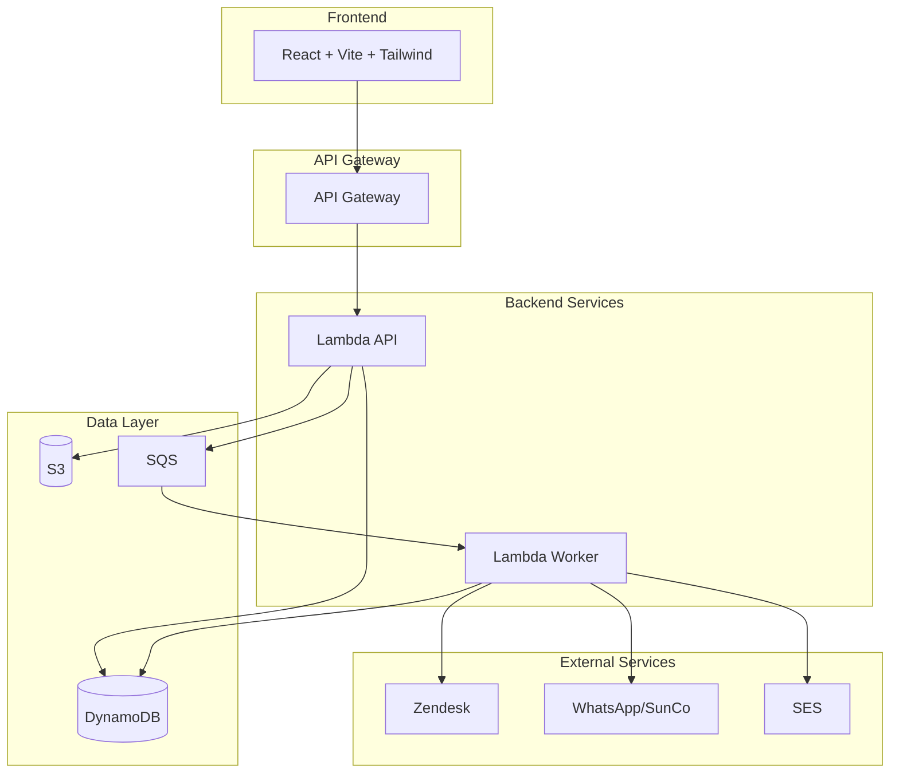
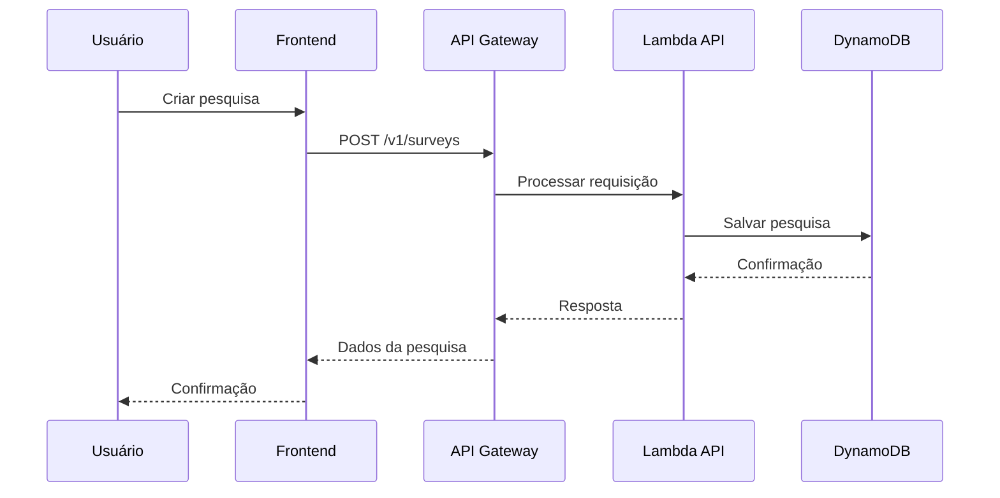
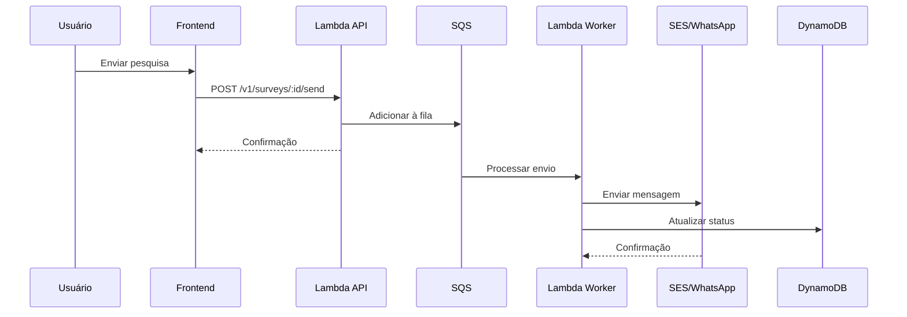
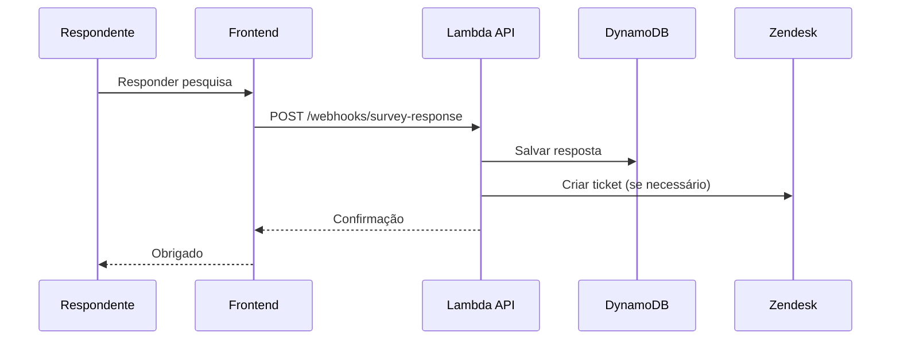

# Arquitetura do Sistema - NPS SaaS

Este documento descreve a arquitetura completa do sistema NPS SaaS, incluindo componentes, fluxos de dados e decisões de design.

## 📋 Índice

- [Visão Geral](#visão-geral)
- [Arquitetura de Alto Nível](#arquitetura-de-alto-nível)
- [Componentes](#componentes)
- [Fluxos de Dados](#fluxos-de-dados)
- [Decisões de Design](#decisões-de-design)
- [Segurança](#segurança)
- [Escalabilidade](#escalabilidade)
- [Monitoramento](#monitoramento)

## 🎯 Visão Geral

O NPS SaaS é um sistema completo para envio e análise de pesquisas NPS (Net Promoter Score) integrado ao Zendesk, com suporte a envio por e-mail e WhatsApp via Sunshine Conversations.

### Objetivos

- **Automação**: Envio automático de pesquisas NPS
- **Integração**: Conexão com Zendesk e WhatsApp
- **Análise**: Dashboard com métricas e insights
- **Escalabilidade**: Suporte a múltiplos clientes (multi-tenant)
- **Confiabilidade**: Alta disponibilidade e recuperação de falhas

## 🏗 Arquitetura de Alto Nível



## 🔧 Componentes

### Frontend (React + Vite + Tailwind)

**Tecnologias:**
- React 18 com TypeScript
- Vite para build e dev server
- Tailwind CSS para estilização
- React Query para gerenciamento de estado
- Zustand para estado global

**Estrutura:**
```
src/
├── components/     # Componentes reutilizáveis
├── pages/         # Páginas da aplicação
├── services/      # Serviços de API
├── stores/        # Estado global
├── utils/         # Utilitários
└── types/         # Tipos TypeScript
```

**Principais Páginas:**
- Dashboard com métricas NPS
- Criação e edição de pesquisas
- Visualização de respostas
- Configurações de integração

### Backend (TypeScript + Fastify + Lambda)

**Tecnologias:**
- Node.js 18 com TypeScript
- Fastify como framework web
- AWS Lambda para execução serverless
- DynamoDB para persistência
- SQS para processamento assíncrono

**Estrutura:**
```
src/
├── routes/        # Rotas da API
├── services/      # Lógica de negócio
├── middleware/    # Middlewares
├── workers/       # Workers assíncronos
├── types/         # Tipos TypeScript
└── utils/         # Utilitários
```

**Principais Rotas:**
- `/v1/auth/*` - Autenticação
- `/v1/surveys/*` - CRUD de pesquisas
- `/webhooks/*` - Webhooks externos

### Infraestrutura (AWS)

**Componentes:**
- **API Gateway**: Roteamento e autenticação
- **Lambda Functions**: Lógica de negócio
- **DynamoDB**: Banco de dados NoSQL
- **S3**: Armazenamento de arquivos
- **SQS**: Fila de mensagens
- **SES**: Envio de e-mails
- **Cognito**: Autenticação de usuários
- **CloudWatch**: Logs e métricas

## 📊 Fluxos de Dados

### 1. Criação de Pesquisa



### 2. Envio de Pesquisa



### 3. Resposta à Pesquisa



## 🎨 Decisões de Design

### 1. Single Table Design (DynamoDB)

**Decisão**: Usar uma única tabela DynamoDB com chaves compostas

**Justificativa**:
- Melhor performance para consultas relacionadas
- Reduz custos de provisionamento
- Facilita queries complexas

**Estrutura**:
```
PK (Partition Key)    | SK (Sort Key)        | Entity
TENANT#123           | METADATA             | Tenant
TENANT#123           | SURVEY#456           | Survey
TENANT#123           | SEND#789             | Send
TENANT#123           | RESPONSE#101         | Response
```

### 2. Serverless Architecture

**Decisão**: Usar AWS Lambda para backend

**Justificativa**:
- Escalabilidade automática
- Pagamento por uso
- Menos manutenção de infraestrutura
- Integração nativa com outros serviços AWS

### 3. Microserviços por Função

**Decisão**: Separar API e Worker em funções Lambda distintas

**Justificativa**:
- Separação de responsabilidades
- Escalabilidade independente
- Facilita debugging e monitoramento
- Permite diferentes configurações de timeout

### 4. Processamento Assíncrono

**Decisão**: Usar SQS para processamento de envios

**Justificativa**:
- Desacoplamento entre API e processamento
- Retry automático em caso de falha
- Dead Letter Queue para falhas persistentes
- Melhor experiência do usuário (resposta rápida)

## 🔒 Segurança

### 1. Autenticação

- **JWT Tokens**: Para autenticação de API
- **Cognito**: Para gerenciamento de usuários
- **Refresh Tokens**: Para renovação de sessão

### 2. Autorização

- **RBAC**: Controle de acesso baseado em roles
- **Tenant Isolation**: Isolamento de dados por cliente
- **API Keys**: Para integrações externas

### 3. Validação

- **Input Validation**: Validação de entrada com Joi/Zod
- **Rate Limiting**: Limitação de requisições
- **CORS**: Configuração adequada de CORS

### 4. Dados Sensíveis

- **Secrets Manager**: Para chaves de API
- **Encryption**: Criptografia em trânsito e em repouso
- **Webhook Signatures**: Validação de webhooks

## 📈 Escalabilidade

### 1. Horizontal Scaling

- **Lambda**: Escala automaticamente
- **DynamoDB**: On-demand scaling
- **SQS**: Processamento paralelo

### 2. Caching

- **API Gateway**: Cache de respostas
- **CloudFront**: CDN para frontend
- **DynamoDB**: Cache de consultas frequentes

### 3. Database Optimization

- **GSI**: Índices globais secundários
- **Batch Operations**: Operações em lote
- **Query Optimization**: Consultas otimizadas

## 📊 Monitoramento

### 1. Logs

- **CloudWatch Logs**: Logs centralizados
- **Structured Logging**: Logs estruturados com Pino
- **Log Levels**: Diferentes níveis de log

### 2. Métricas

- **CloudWatch Metrics**: Métricas customizadas
- **X-Ray**: Tracing distribuído
- **Custom Dashboards**: Dashboards personalizados

### 3. Alertas

- **Error Rate**: Taxa de erro
- **Latency**: Latência de resposta
- **DLQ Messages**: Mensagens na Dead Letter Queue
- **Resource Usage**: Uso de recursos

### 4. Health Checks

- **API Health**: Endpoint de saúde da API
- **Dependency Checks**: Verificação de dependências
- **Database Health**: Saúde do banco de dados

## 🔄 Integrações

### 1. Zendesk

- **API Integration**: Criação automática de tickets
- **Webhook Handling**: Processamento de eventos
- **Data Sync**: Sincronização de dados

### 2. WhatsApp (Sunshine Conversations)

- **Template Messages**: Mensagens de template
- **Proactive Messages**: Mensagens proativas
- **Webhook Processing**: Processamento de respostas

### 3. E-mail (SES)

- **Template Engine**: Templates de e-mail
- **Bounce Handling**: Tratamento de bounces
- **Delivery Tracking**: Rastreamento de entrega

## 🚀 Deploy e CI/CD

### 1. Ambientes

- **Development**: Ambiente de desenvolvimento
- **Staging**: Ambiente de homologação
- **Production**: Ambiente de produção

### 2. Pipeline

- **GitHub Actions**: CI/CD automatizado
- **Automated Testing**: Testes automáticos
- **Security Scanning**: Verificação de segurança
- **Deployment**: Deploy automatizado

### 3. Rollback

- **Blue/Green**: Deploy sem downtime
- **Rollback Strategy**: Estratégia de rollback
- **Health Checks**: Verificação de saúde

## 📚 Próximos Passos

1. **Implementação**: Desenvolvimento dos componentes
2. **Testes**: Testes unitários e de integração
3. **Deploy**: Deploy em ambiente de desenvolvimento
4. **Monitoramento**: Configuração de monitoramento
5. **Documentação**: Documentação de usuário
6. **Treinamento**: Treinamento da equipe

---

Esta arquitetura foi projetada para ser escalável, confiável e fácil de manter, seguindo as melhores práticas de desenvolvimento de software e arquitetura de sistemas.
